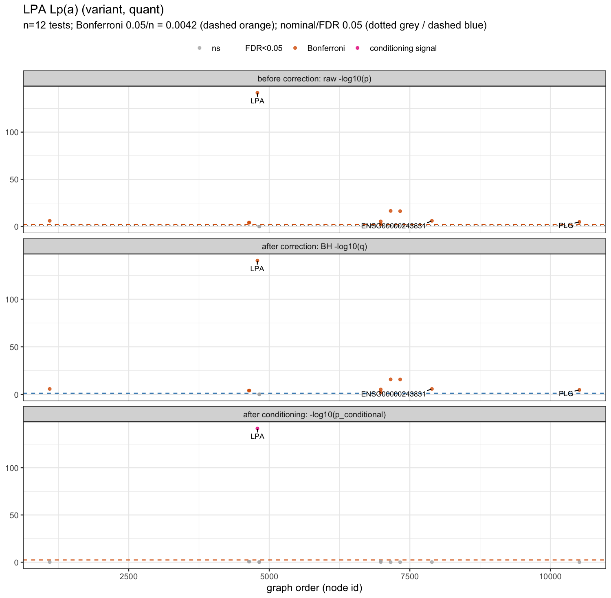
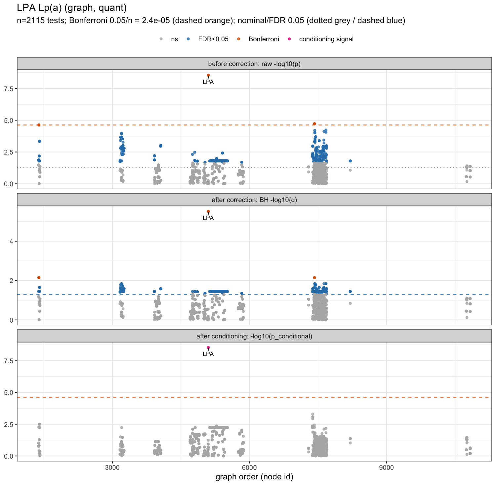
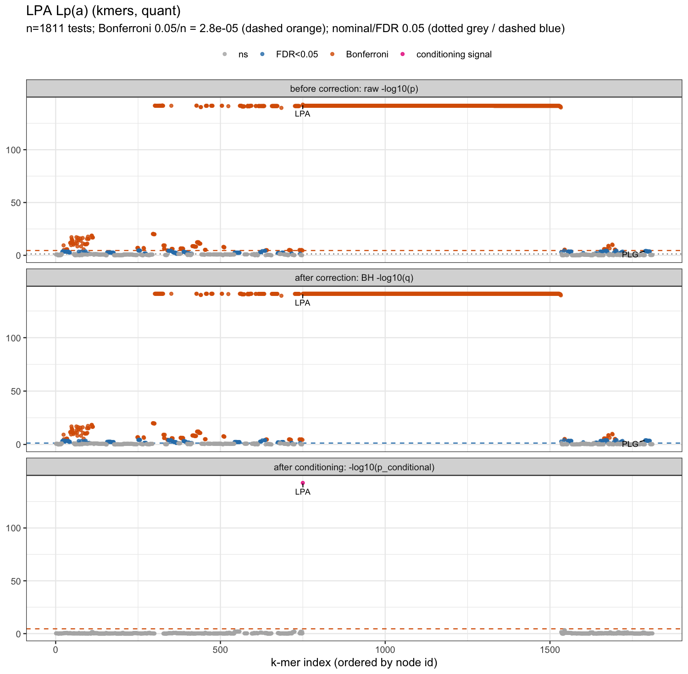
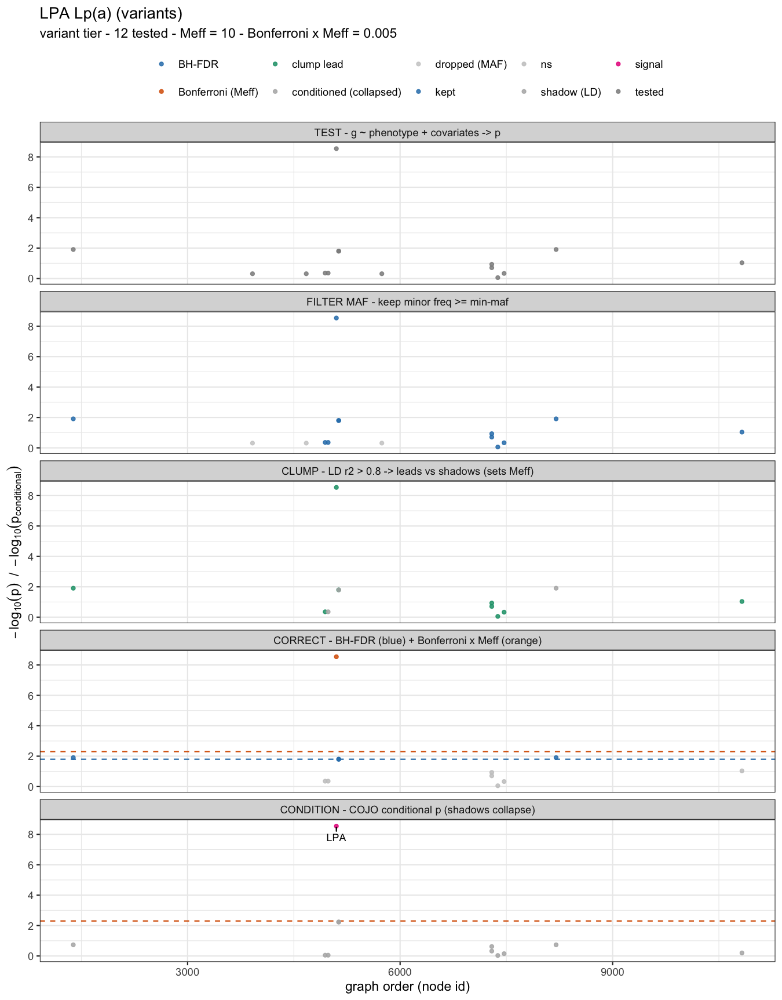
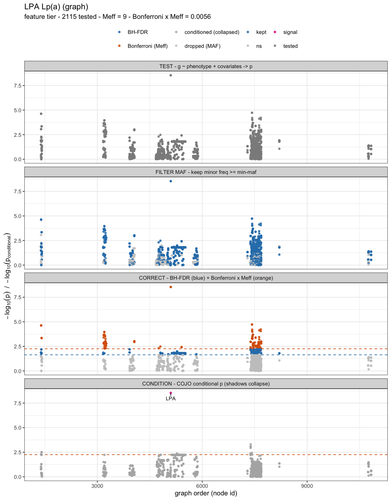
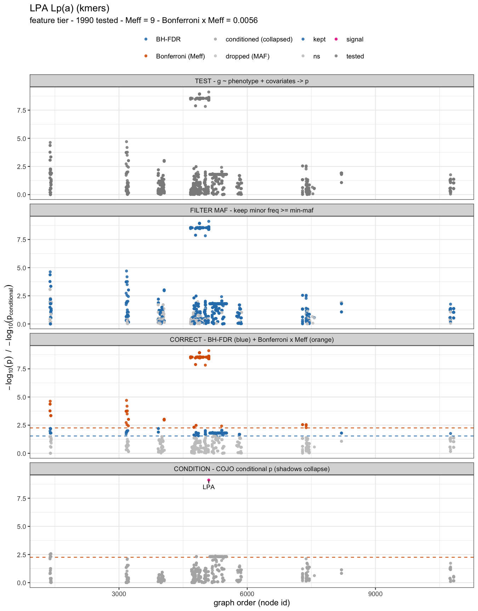

# Association with panvar — a worked example

The association half of the pipeline, run on the output of the [walkthrough](walkthrough.md). Variant calling and feature description produce the genotype matrices; this page tests them.

## The cohort

`tests/gwas/make_lpa_phenotype.py` reads the KIV-2 counts written by `panphorte`, splits the real haplotypes into simulated subpopulations with different array frequencies, pairs them into diploid samples, and simulates a quantitative phenotype driven by diploid copy number plus a subpopulation offset. Age, sex and ten simulated ancestry covariates are included in the phenotype table.

This is an end-to-end positive control for feature export and association: the causal dosage is deliberately known and should be recovered. It is not an independent validation of KIV-2 copy number, because the phenotype and tested REP dosage ultimately come from the same normalized graph. The independent check used in this repository is the comparison with the committed assembly-derived repeat counts in the [walkthrough](walkthrough.md).

Two cohorts exist, and the numbers on this page come from the second:

- `tests/gwas/lpa/` is committed and runnable directly: a 6,000-sample cosigt table with quantitative and binary phenotypes, each with and without ancestry principal components.
- `scripts/regen_results.sh lpa` generates a smaller cohort under `results/real_data/lpa/gwas/real/` and runs everything below on it. That run produced every figure here: 300 samples, of which 285 have complete phenotype and covariate data and are used.

The genotype matrices live under `results/real_data/lpa/gwas/desc/`, one folder per substrate, at both haplotype and diploid-sample level.

## Test the variant unit

```bash
panvar associate \
  --genotypes results/real_data/lpa/gwas/desc/sample/variant/bimbam_variant.bimbam.gz \
  --samples   results/real_data/lpa/gwas/desc/sample/variant/samples.txt.gz \
  --feature-annot results/real_data/lpa/gwas/desc/sample/variant/feature_annot.variant.tsv.gz \
  --phenotype results/real_data/lpa/gwas/real/pheno.quant.tsv \
  -o results/real_data/lpa/gwas/associate/assoc_variant_quant
```

The unit is auto-detected as `variant` from the sidecar, so the test count is the number of VCF records rather than the number of graph or k-mer markers. Here 12 records are tested after the non-modal-genotype frequency filter drops 5. A record is a convenient testing unit, but linked DEL/INS records and records in LD need not be independent biological events.

The array's duplication, `bubble6_DUP_5100`, comes out at `p = 2.9e-09`. Because the variant substrate carries the duplication's copy number as its dosage rather than a presence flag, that test is on the copy number itself.



## Test the graph and k-mer substrates

```bash
panvar associate \
  --genotypes results/real_data/lpa/gwas/desc/sample/graph/bimbam_graph.bimbam.gz \
  --samples   results/real_data/lpa/gwas/desc/sample/graph/samples.txt.gz \
  --feature-annot results/real_data/lpa/gwas/desc/sample/graph/feature_annot.graph.tsv.gz \
  --phenotype results/real_data/lpa/gwas/real/pheno.quant.tsv \
  -o results/real_data/lpa/gwas/associate/assoc_graph_quant
```

These substrates keep every node, edge and k-mer test, so they localize the association signal within the represented locus at the cost of many correlated tests. They do not by themselves establish which correlated feature is causal.



The graph scan's top feature is node `5100` — the repeat-unit node itself, and the same node the variant-level record is anchored on, at the same p-value. The two substrates are describing one thing at different granularities.



The k-mer substrate tells the same story more finely, its strongest marker reaching `p = 7.7e-10`, with the repeat-unit k-mers all peaking together.

Across the three, on the same cohort:

| substrate | tested | `Meff` | method | `p_bonf_meff < 0.05` | `q_bh < 0.05` |
|---|---|---|---|---|---|
| variant | 12 | 10 | Li–Ji eigenvalue | 1 | 5 |
| graph | 2,115 | 9 | distinct bubbles | 184 | 977 |
| k-mers | 1,990 | 9 | distinct bubbles | 942 | 1,178 |

The variant substrate is the coarsest denominator: one test per retained VCF record. The graph and k-mer substrates are useful for locating signal, but their large numbers of correlated hits must not be counted as independent discoveries.

## Reading the corrections

- `p_bonf` is the raw Bonferroni adjustment over all tested features. Provided the individual p-values are valid, it controls family-wise error without requiring independent features, although correlation can make it conservative.
- `p_bonf_meff` replaces the raw test count with `Meff`. In the variant unit, `Meff` is the phenotype-blind Li–Ji eigenvalue estimate of the genotype correlation matrix when the matrix is small enough; LD clumping is the fallback and also supplies lead/shadow labels. Here Li–Ji gives 10 and clumping gives 9. Phenotype blindness avoids circular use of the outcome, but an effective-test estimate is still an approximation and does not provide the general guarantee of raw Bonferroni. In feature units, `Meff` is the number of distinct bubbles, a biological grouping rather than a statistically calibrated count.
- `q_bh` is the Benjamini–Hochberg adjustment. Its usual false-discovery-rate guarantee requires the corresponding assumptions on valid p-values and their dependence; the column should not be read as a universal guarantee for arbitrary correlated local features.
- `p_conditional` and `cond_role` ask whether a feature adds signal after the selected features. At the default entry threshold (`0.05/Meff = 0.005` here), the array duplication is the only selected signal. Two linked records have conditional p-values near the cutoff (0.00586), so “one selected signal” is more accurate than saying every other association disappears.

## The pipeline, stage by stage

`scripts/plot_associate_pipeline.R` draws one facet per stage, recolouring the same markers by what survives each, so the funnel from every test down to the independent signal is visible in one figure.

1. `TEST` — every marker is tested and shown at its raw p-value.
2. `FILTER MAF` — markers below `--min-maf` are greyed out.
3. `CLUMP` — variant unit only: variants are grouped by genotype correlation into leads and shadows.
4. `CORRECT` — both thresholds are drawn, and each marker is coloured by the strictest it passes.
5. `CONDITION` — conditional p-values after the forward-stepwise stage; `signal` means the feature met the configured entry rule, while `shadow` did not.







The feature tiers have no `CLUMP` facet, since clumping applies to the variant unit only.

## Reading `lambda_gc` at one locus

`lambda_gc` reads the median chi-square on the assumption that most tests are null. That holds genome-wide and fails at a single locus, where a real signal and everything in linkage disequilibrium with it can be most of the tests. It reads 5.85 on the variant scan above and 10.13 on the graph scan — those measure the effect, not inflation. The run summary says which situation it is in and only calls it an inflation estimate when there are enough tests and few enough of them significant.

## Structure correction, on a panel where it can be judged

To demonstrate structure confounding, the driver also builds 3,000 simulated null markers alongside the real copy-number dosage. Their allele frequencies and the phenotype offset both vary by the same simulated subpopulation. This is a calibration fixture with many nulls, not a substitute for a real genome-wide validation.

```bash
# no ancestry covariates
panvar associate --genotypes <panel.bimbam.gz> --samples <...> --feature-annot <...> \
  --phenotype <pheno.quant.nopc.tsv> --min-maf 0.02 -o sim_naive
# the same phenotype, with the principal components as covariates
panvar associate --genotypes <panel.bimbam.gz> --samples <...> --feature-annot <...> \
  --phenotype <pheno.quant.tsv>      --min-maf 0.02 -o sim_pc
# a linear mixed model instead, with an external relationship matrix
panvar associate --genotypes <panel.bimbam.gz> --samples <...> --feature-annot <...> \
  --phenotype <pheno.quant.nopc.tsv> --model lmm --kinship <grm.tsv> --min-maf 0.02 -o sim_lmm
```

| analysis | `lambda_gc` | significant at `p_bonf_meff` |
|---|---|---|
| no ancestry covariates | 2.22 | 122 |
| with principal components | 1.02 | 1 |
| linear mixed model | 2.22 | 122 |

The supplied simulated ancestry covariates do the work in this fixture: inflation collapses toward nominal and the 122 apparent hits reduce to the one planted signal.

The mixed model does not correct this fixture. The generated relationship matrix is based on sharing among the LPA panel haplotypes, not genome-wide markers, and the fitted variance ratio is around 1.3e5: the random effect is effectively negligible, so the result matches the uncorrected model. This is a negative control for this particular GRM, not evidence against mixed models generally. Treat the implementation as experimental: its external comparison currently checks correlation only, which could miss systematic differences in effect size, standard error or p-value.

In short, this page demonstrates that a planted KIV-2 dosage effect survives the export and association pipeline and that the supplied covariates remove the confounding designed into this simulation. It does not establish CN accuracy, real-cohort calibration, causal fine-mapping, or independent validation of the LMM.

## See also

- [associate](modules/associate.md) — units, options, output columns and limitations.
- [algorithms/associate.md](algorithms/associate.md) — which test is used where, and why.
- [walkthrough](walkthrough.md) — the calling and feature-description steps that produce these matrices.
