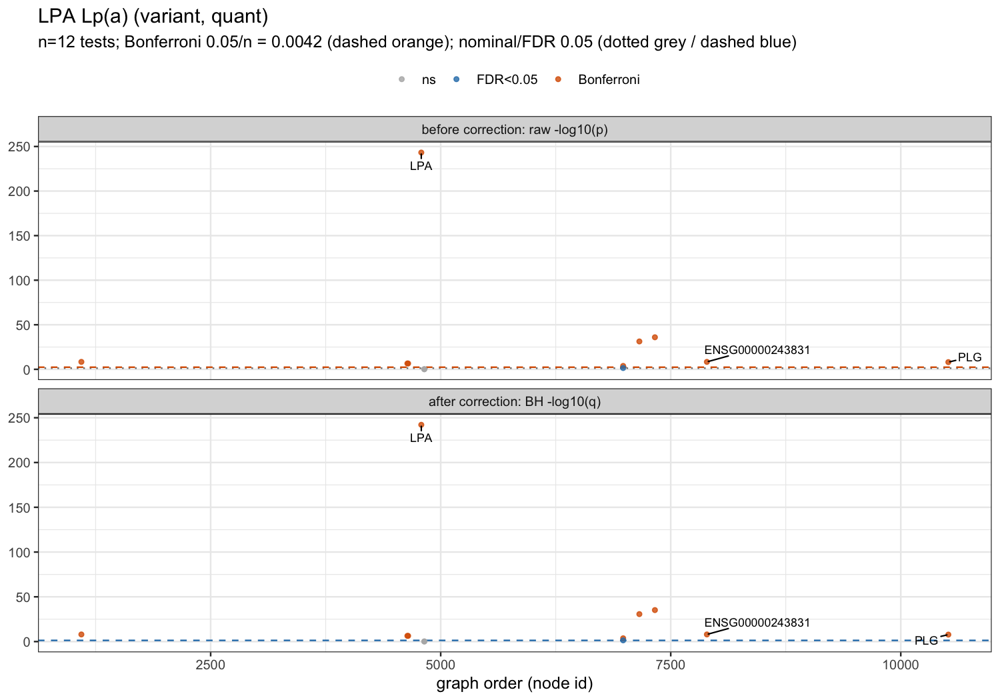
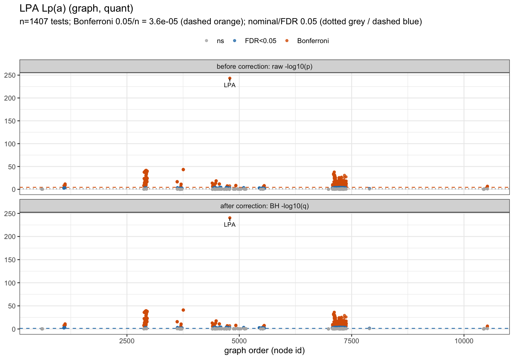
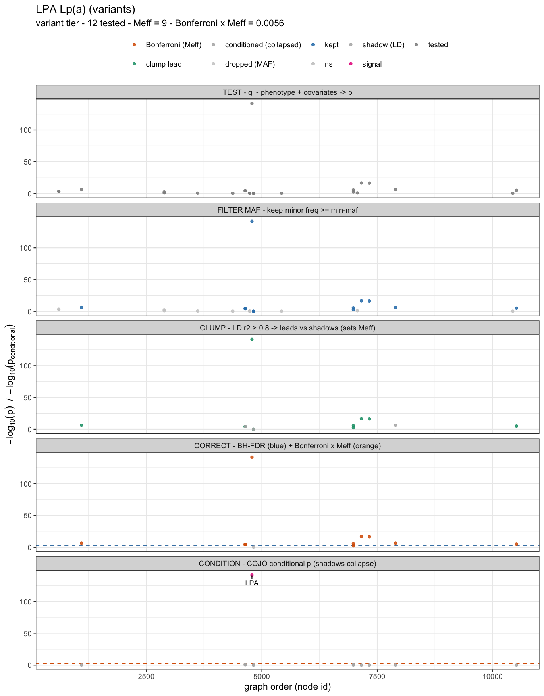
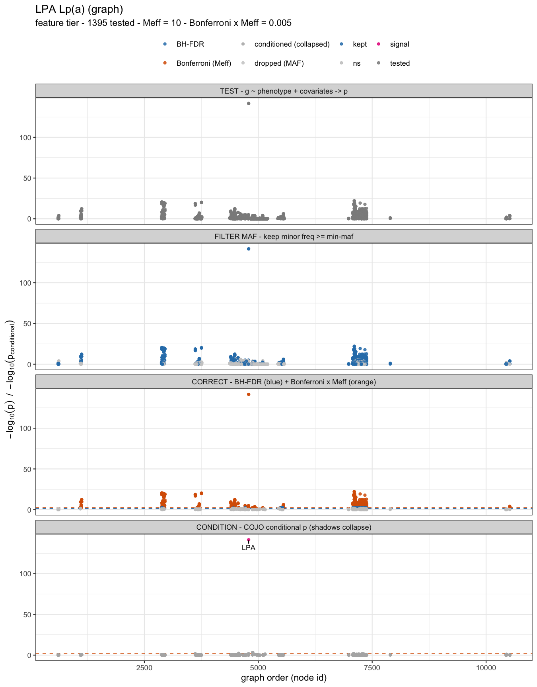
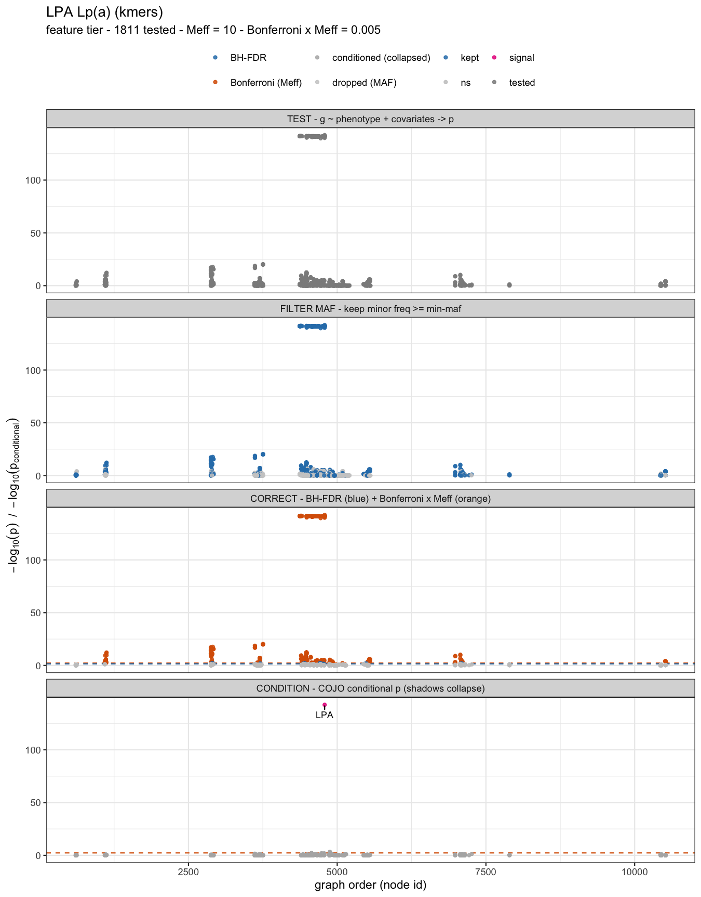

# Pangenome association with panvar — the LPA / KIV-2 example

A worked, end-to-end GWAS on `panvar`'s output: what we test, why particular nodes, variants and k-mers light
up, and how the multiple-testing corrections change the verdict. Each concept (dosage, MAF, multiple testing,
LD, structure, λ) is explained where it first matters; the methods behind them are cited in
[references.md](../references.md#associate).

The trait is **LPA / KIV-2**. The *LPA* gene carries a tandem repeat, the KIV-2 VNTR, whose **copy number is
inversely associated with plasma Lp(a)** (more copies → lower Lp(a) → lower cardiovascular risk). It is the
ideal copy-number example: the repeat unit is present in *every* individual, so the whole signal is in the
count, not in presence/absence — exactly what a SNP array or a single linear reference cannot see, and what a
pangenome makes testable.

The phenotypes here are **simulated** (see below), so this demonstrates *recovering a planted signal under
realistic population structure*, not a real Lp(a) study.

## How a pangenome GWAS is set up

A linear-reference GWAS can only test what the reference spells out; it is blind to sequence absent from the
reference and to VNTR copy number — which is where Lp(a) lives. A pangenome represents all haplotypes, so this
structural variation becomes a genotype. `panvar` builds the association inputs in four steps:

1. **`cosigt`** genotypes each sequenced sample by assigning it the **pair of haplotype paths** it best matches
   at the locus (its two alleles).
2. **`call`** types the structural variants in the graph and, for the KIV-2 tandem, records each haplotype's
   copy number directly (the `REP` self-loop traversal count).
3. **`describe`** turns the graph into per-haplotype genotype features on three substrates (below), and with a
   `cosigt` table sums each sample's two haplotypes into a diploid dosage (for KIV-2, `CN_A + CN_B`).
4. **`associate`** regresses the phenotype on each genotype and corrects for multiple testing.

## The example cohort (simulated)

`tests/gwas/make_lpa_phenotype.py` reads each real haplotype's KIV-2 copy number (from `panphorte`), splits
the haplotypes into **3 subpopulations** with different KIV-2 frequencies **and** a baseline Lp(a) offset (an
ancestry confounder), then draws **~6,000 diploid individuals** — the scale of the Moli-sani whole-genome
cohort genotyped with cosigt, so the demo mirrors a real run. Each individual's Lp(a) is log-normal with the
inverse KIV-2 effect, an age and sex term, the subpopulation offset, and noise; ~5% of phenotypes are set to
`NA`. Ten ancestry components `PC1..PC10` are emitted as covariate columns (only the first two carry the
subpopulation signal — a realistic scree). The phenotype is **simulated** (we model the known KIV-2→Lp(a)
effect); it is not a real Moli-sani measurement.

The resulting tables are committed under `tests/gwas/lpa/` so the pipeline is runnable directly:

| file | what it is |
|------|-----------|
| `samples.tsv` | the cosigt cohort: `sample <tab> haplotype_1 <tab> haplotype_2` |
| `pheno.quant.tsv` | quantitative phenotype (log10 Lp(a)) + `Age, Sex, PC1..PC10` |
| `pheno.binary.tsv` | high-risk case/control (0/1) + the same covariates |
| `pheno.quant.nopc.tsv` | quantitative phenotype **without** the PCs (the naive, uncorrected analysis) |

## Run it all

The driver runs `bubble → panphorte → call → describe → associate → plots` plus a self-check. Use it to
reproduce everything, then read the sections below for what each step does:

```bash
# numpy-capable python for the cohort sim; Rscript needs ggplot2 (e.g. conda activate base)
bash tests/gwas/run_lpa_real.sh build/panvar results/real_data/lpa/gwas python3 Rscript          # quick
bash tests/gwas/run_lpa_real.sh build/panvar results/real_data/lpa/gwas python3 Rscript --big     # ~6k cohort (Moli-sani scale)
```

The rest of this page walks the same steps one command block at a time.

## Step 1 — call the variants

```bash
panvar call -i results/real_data/lpa/panphorte/panphorte.normalized.sorted.gfa \
  --bubble-prefix-in results/real_data/lpa/panphorte/panphorte --reference-path grch38#1 \
  -o results/real_data/lpa/call/call --cn \
  --gtf tests/real_data/Homo_sapiens.GRCh38.116.gtf.gz
```

This writes the multi-sample VCF (`call.region.vcf`) — one record per SV call, with per-haplotype `GT`/`CN` —
plus `variant_nodes.tsv` (each variant's graph nodes) and, from `--gtf`, `node_genes.tsv` (which node belongs
to *LPA*). KIV-2 is a `DUP` whose per-haplotype `CN` is the copy number (here 1–32).

## Step 2 — describe: three genotype substrates

```bash
panvar describe -i results/real_data/lpa/panphorte/panphorte.normalized.sorted.gfa \
  --bubble-prefix-in results/real_data/lpa/panphorte/panphorte \
  --out-dir results/real_data/lpa/gwas/desc --kmer-size 31 --no-wide-matrix \
  --variant-nodes results/real_data/lpa/call/call.variant_nodes.tsv \
  --variant-vcf results/real_data/lpa/call/call.region.vcf \
  --samples tests/gwas/lpa/samples.tsv
```

This emits a BIMBAM dosage matrix on each of three substrates, plus the per-sample (diploid) version each:

- **variant** — one row per SV call (`bimbam_variant.*`): copy number for the KIV-2 `DUP`, presence for
  DEL/INS/INV. This is the unit a GWAS should test.
- **graph** — per-node and per-edge traversal dosage (`bimbam_graph.*`): the KIV-2 copy number appears as the
  multiplicity of the repeat node and its self-loop edge.
- **k-mers** — canonical k-mers (`bimbam_kmers.*`): the same copy number spread across the repeat-unit markers.

## Step 3 — associate the variant unit (the honest test)

```bash
panvar associate \
  --genotypes results/real_data/lpa/gwas/desc/bimbam_variant.samples.bimbam.gz \
  --samples   results/real_data/lpa/gwas/desc/bimbam_variant.samples.samples.txt.gz \
  --feature-annot results/real_data/lpa/gwas/desc/feature_annot.variant.tsv.gz \
  --phenotype tests/gwas/lpa/pheno.quant.tsv -o results/real_data/lpa/gwas/assoc_variant_quant
```

`--unit` auto-detects `variant` from the sidecar, so the test count is the number of SV calls — the honest
denominator. The KIV-2 duplication `bubble7_DUP_4789` is the top hit by a wide margin (its dosage is the full
copy-number gradient in a single test), `is_lead=1` for its LD-clump, `low_af=0` (a DUP carried by almost
everyone is still informative), and it survives both `q_bh` and the `Meff`-Bonferroni threshold.

With one test per SV call the scan is sparse, and KIV-2 stands clear of the LD-clumped `Meff`-Bonferroni line:



## Step 4 — associate the feature substrates (fine-mapping + Meff)

```bash
panvar associate \
  --genotypes results/real_data/lpa/gwas/desc/bimbam_graph.samples.bimbam.gz \
  --samples   results/real_data/lpa/gwas/desc/bimbam.samples.samples.txt.gz \
  --feature-annot results/real_data/lpa/gwas/desc/feature_annot.samples.tsv.gz \
  --node-genes results/real_data/lpa/call/call.node_genes.tsv \
  --phenotype tests/gwas/lpa/pheno.quant.tsv --min-maf 0.02 -o results/real_data/lpa/gwas/assoc_graph_quant
```

Run the same on `bimbam_kmers.*` for the k-mer substrate. These keep every node/edge/k-mer test, so they
fine-map *within* the locus, but their raw count over-states the number of independent tests; `associate`
corrects with `Meff` = the number of distinct bubbles (reported as `meff`, with a per-marker `p_bonf_meff`).

The region scan recovers KIV-2 cleanly — the peak is the repeat node and its self-loop edge, far above the
`Meff`-Bonferroni line, with the expected **negative** effect (more copies → lower Lp(a)):



The k-mer substrate tells the same story at finer grain — many more correlated tests (the repeat-unit k-mers),
all peaking on KIV-2, with `Meff` again collapsing them to the distinct bubbles before the Bonferroni line:


## Why these nodes, variants and k-mers light up

All three substrates converge on the same place because they are three views of one fact — the KIV-2 copy
number:

- the **variant** record `bubble7_DUP_4789` carries the copy number explicitly in its dosage;
- in the **graph** substrate the top features are the repeat node `4789` and its self-loop edge
  `4789+>4789+`, because a haplotype with more copies traverses them more times — the most direct graph read
  of copy number;
- in the **k-mer** substrate the repeat-unit k-mers occur once per copy, so their counts track the same dosage.

With `--node-genes`, every one of these is labelled **`LPA`** in the `gene` column, and the `bubbles`/`nodes`
columns trace each back through `call`'s `variant_nodes.tsv` to the KIV-2 `DUP`.

## Reading the corrections

`associate` reports several columns precisely so a "hit" can be judged rather than taken on faith:

- **`q_bh`** (Benjamini–Hochberg FDR) is the primary control — the expected fraction of false positives among
  the calls you accept. Use `q_bh < 0.05`.
- **`p_bonf_meff`** is the conservative benchmark: `p` scaled by the effective number of independent tests
  (`Meff`), not the inflated raw count. The summary also gives `bonferroni_threshold_meff`.
- **`clump` / `is_lead`** (variant unit) group LD-correlated variants: a lead and its shadows share a `clump`,
  and only leads count toward `Meff`. So a run of neighbouring DELs in LD with KIV-2 is reported once, not as
  several independent findings.
- **`low_af`** flags variants with too few minority observations to give a stable p — a power caveat, not a
  significance call. Such a variant also cannot anchor a clump.
- **`p_conditional` / `cond_role`** test *independence*, which clumping alone cannot: clumping uses genotype
  r², but a variant only weakly correlated with KIV-2 (r² far below `--ld-r2`) can still be marginally
  significant just by tagging such a strong locus. Conditioning refits with the top signal(s) as covariates.
  In the variant unit a forward-stepwise (COJO) pass selects the jointly-independent signals (`cond_role=signal`)
  and exposes the rest as `shadow` whose `p_conditional` collapses; the summary's `cojo_independent_signals`
  counts the signals. In the feature unit, cross-bubble features get a conditional p while features collinear
  with the lead (same copy-number event) are flagged `cond_role=collinear` rather than scored. Here a nearby
  PLG insertion is marginally significant (`p ≈ 8e-9`) yet `p_conditional ≈ 0.3` — a KIV-2 shadow, not an
  independent Lp(a) signal — and `cojo_independent_signals = 1`.

The summary's `unit`, `meff`, `significant_bonferroni_meff` and `cojo_independent_signals` make the chosen
unit, effective test count, and number of independent signals explicit. The Manhattan plot adds a third
**after-conditioning** panel where the shadows fall below the line and only the conditioning signal stays up.

## The association pipeline, stage by stage

`scripts/plot_associate_pipeline.R` draws one Manhattan facet per processing stage, re-colouring the *same*
markers by what survives each stage, so the funnel from "everything tested" down to "the independent signal"
is explicit. It needs the normal run plus a `--min-maf 0` run of the same data (so the MAF-dropped markers are
visible in the first two stages). The driver produces these automatically.

The stages, and what each does:

1. **TEST** — every marker is tested (`phenotype ~ dosage + covariates`); raw `-log10(p)`.
2. **FILTER MAF** — markers below `--min-maf` are dropped (greyed), the rest kept.
3. **CLUMP** *(variant tier only)* — variants are grouped by **genotype r² > `--ld-r2`** into leads and LD
   shadows; the number of leads is `Meff`. The feature tiers skip this — their `Meff` is the number of
   distinct bubbles, so there is no clumping facet for k-mers / nodes.
4. **CORRECT** — the two thresholds are drawn together: **Bonferroni·Meff** (orange) and **BH-FDR** (blue);
   each marker is coloured by the strictest it passes.
5. **CONDITION** — conditional `-log10(p_conditional)` after COJO: the shadows collapse below the line and
   only the **independent signal(s)** (magenta) stay up.

**Variant tier** — the honest unit; the CLUMP stage is present, and a single COJO signal (KIV-2 / `LPA`)
survives conditioning while neighbours like `PLG` collapse:



**Graph nodes / edges** — no CLUMP stage (`Meff` = distinct bubbles); conditioning on the top KIV-2 feature
collapses the rest of the region:



**k-mers** — identical machinery to the graph tier (no CLUMP), on per-path k-mer counts:



## A word on λ in a single region

The genomic-inflation factor `lambda_gc` assumes that **most tests are null**. That holds genome-wide, but a
single pangenome locus is the opposite: almost every marker tags the one causal variant, so `lambda_gc` is
large *by construction* and is **not** a structure diagnostic here. (With only a handful of variant-unit tests
it is unstable for the additional reason of small n.) λ becomes meaningful in the structure demo below, which
adds genuinely null markers.

## Structure correction on a genome-wide-like panel

To show what PCs and the LMM buy you, the driver also builds a synthetic genome-wide-like panel — the real
KIV-2 dosage plus many subpopulation-stratified null markers — where λ *is* interpretable. The subpopulation
confounder inflates a naive scan and buries the causal signal; modelling structure restores calibration and
surfaces KIV-2:

| analysis | covariates | λ | KIV-2 |
|----------|-----------|---|-------|
| naive | Age, Sex | ≫ 1 (inflated) | buried among nulls |
| + ancestry PCs | Age, Sex, PC1..PC10 | → ≈ 1 | rises to the top |
| LMM, external GRM | Age, Sex (+ random effect) | ≈ 1 | top |

```bash
# naive (no PCs) -> inflated lambda; then add the PC covariate columns
panvar associate --genotypes <panel.bimbam.gz> --samples <…> --feature-annot <…> \
  --phenotype tests/gwas/lpa/pheno.quant.nopc.tsv -o sim_naive
panvar associate --genotypes <panel.bimbam.gz> --samples <…> --feature-annot <…> \
  --phenotype tests/gwas/lpa/pheno.quant.tsv     -o sim_pc
# LMM needs an EXTERNAL genome-wide GRM (panvar does not build one); pass it with --kinship
panvar associate --genotypes <panel.bimbam.gz> --samples <…> --feature-annot <…> \
  --phenotype tests/gwas/lpa/pheno.quant.nopc.tsv --model lmm --kinship <grm.tsv> -o sim_lmm
```

This panel is a control to demonstrate the correction; the result on the actual pangenome is the region scan
above. Compare `lambda_gc` across `sim_naive` / `sim_pc` / `sim_lmm` to see inflation collapse toward 1. At
the ~6k scale shown here the driver runs the PC path (`sim_naive` → `sim_pc`) and skips the LMM demo, since
the dense GRM is only materialised for smaller cohorts (`N ≤ 4000`); to reproduce `sim_lmm`, run at a capped
`N` or supply your own external `--kinship` GRM.

## Validation against GEMMA

`panvar associate` is a from-scratch engine, so `tests/gwas/validate_gemma.sh` checks it against **GEMMA** on
the same BIMBAM panel and phenotype (BIMBAM is GEMMA's native format, so the genotypes load unchanged):

| comparison | r(β) | r(−log10 p) |
|------------|------|-------------|
| linear (`--model linear` vs GEMMA `-lm`) | ≈ 1.000 | ≈ 1.000 |
| mixed (`--model lmm --kinship` vs GEMMA `-lmm`) | ≈ 0.9997 | ≈ 0.9997 |

The statistics match. The only wrinkle is the **copy-number marker**: GEMMA's allele-frequency model assumes a
diploid 0–2 dosage, so a *raw* KIV-2 count (well above 2) reads as "allele frequency ≫ 1" and GEMMA mis-handles
it. This is **not** a failure to validate — GEMMA just needs the dosage in its expected range, which `panvar`
provides: regenerate the BIMBAM with `describe --scale-dosage` and each feature is rescaled to 0–2 (a
per-feature linear map, so the linear-model p-values are unchanged). On that scaled BIMBAM **GEMMA tests KIV-2
too and recovers the same β and significance** `panvar` reports. So the two agree across the board — and on the
copy-number marker as well, once the dosage is scaled to GEMMA's range. (`panvar` itself makes no 0–2
assumption and tests the raw copy number directly.)

## Caveats

- The phenotypes are **simulated** (a literature-grounded inverse KIV-2 effect + age/sex + a subpopulation
  offset + noise; high-risk binary at 50 mg/dL). The subpopulations and PCs are synthetic ancestry. Grounding
  literature is in [references.md](../references.md).
- The **structure-correction panel is synthetic** — it exists *because* a single region has no null markers,
  so λ and the PC/LMM correction are only meaningful at genome-wide-like scale. The variant- and
  feature-level region scans are the result on the actual pangenome.
- The **LMM needs an external genome-wide GRM** (`--kinship`); `panvar` is local and does not build one, as a
  region GRM would be contaminated by the signal under test. Without a GRM, use the PC covariate columns.
- Counts are the *graph-derived* per-haplotype multiplicity; with real reads you would also carry the
  read-depth uncertainty from `cosigt` into the dosage.

## See also
- [associate](../modules/associate.md) — the engine, units, corrections, and output columns.
- [describe](../modules/describe.md) — the three BIMBAM substrates and `--samples` / `--variant-vcf`.
- [references.md](../references.md#associate) — methods (EMMAX/GEMMA, Benjamini–Hochberg) and the LPA/Lp(a) literature.
