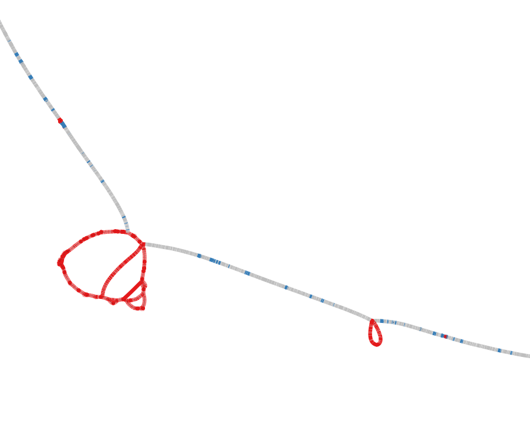
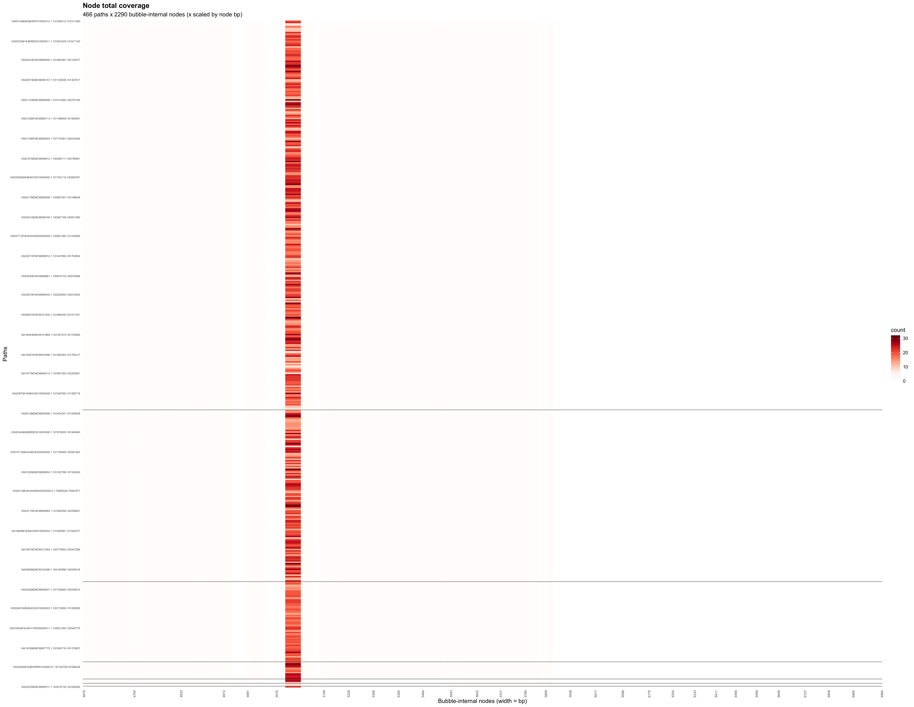
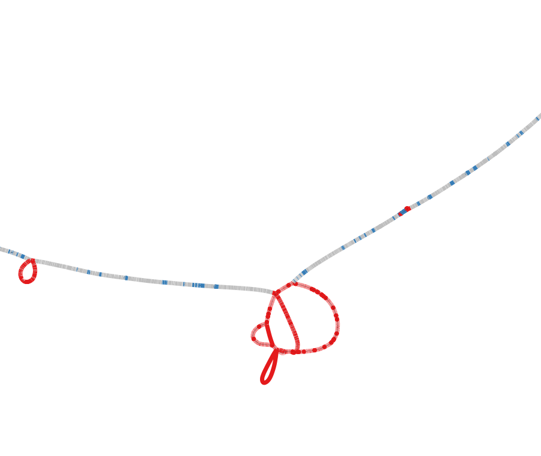
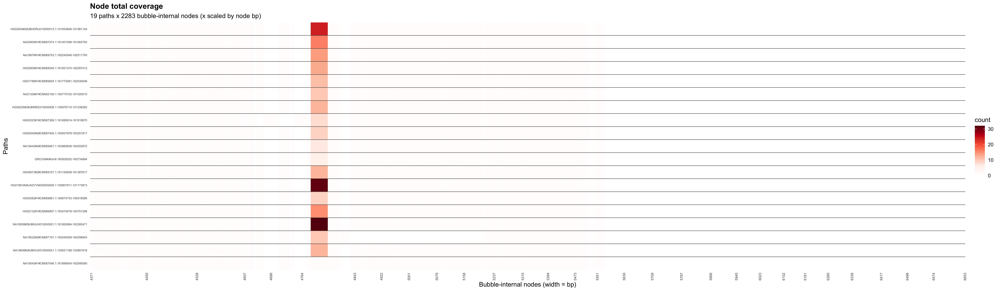
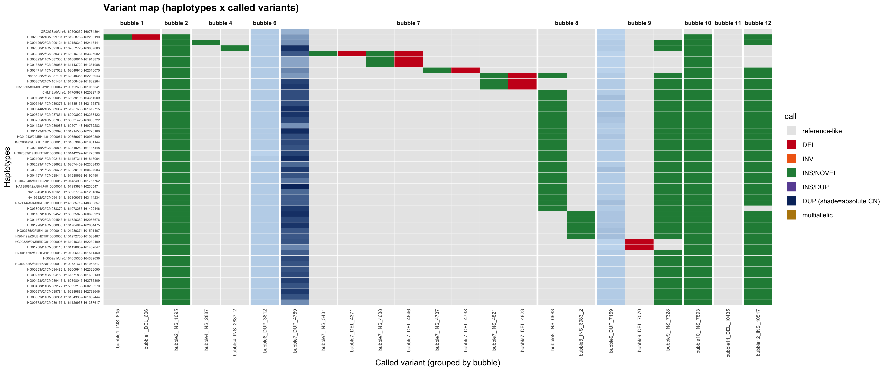
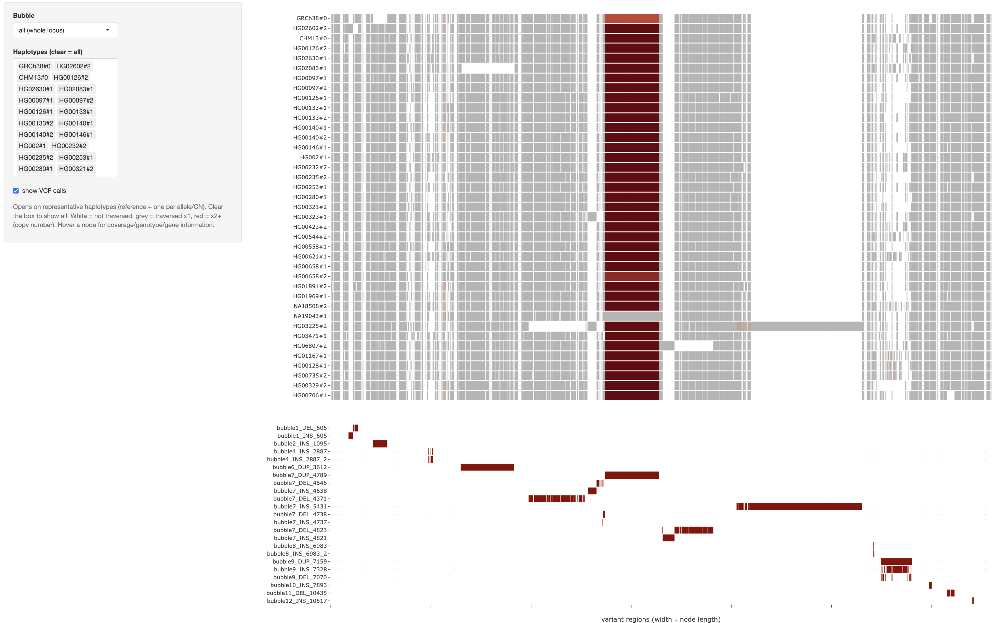
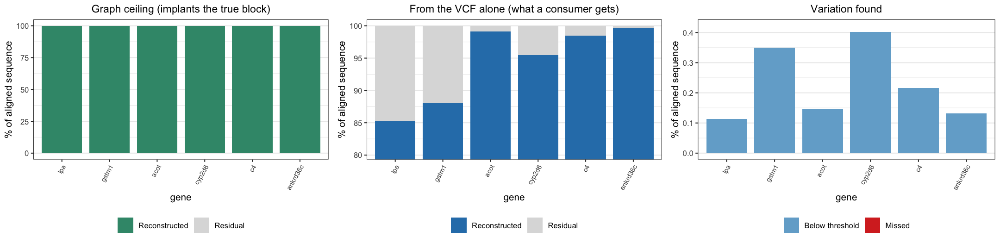
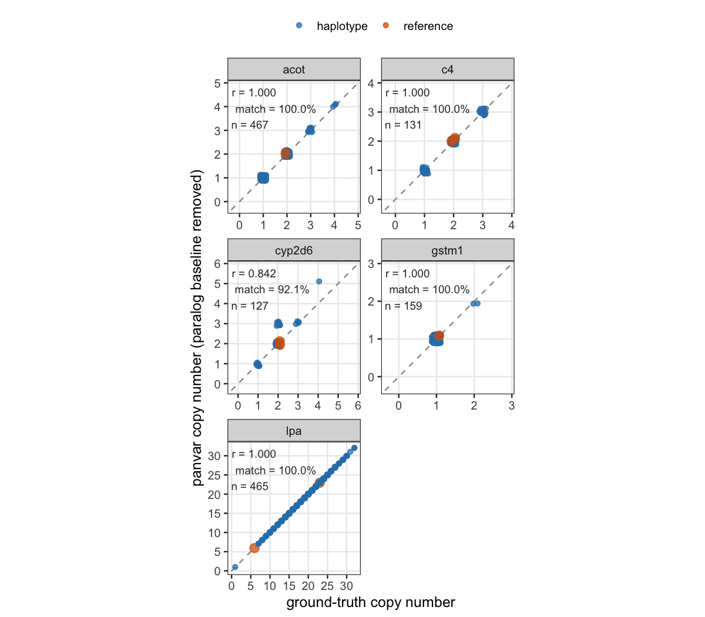
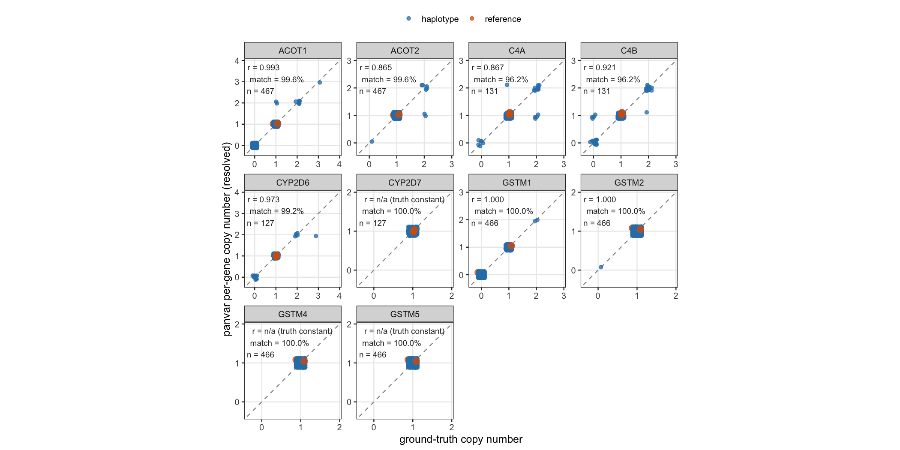
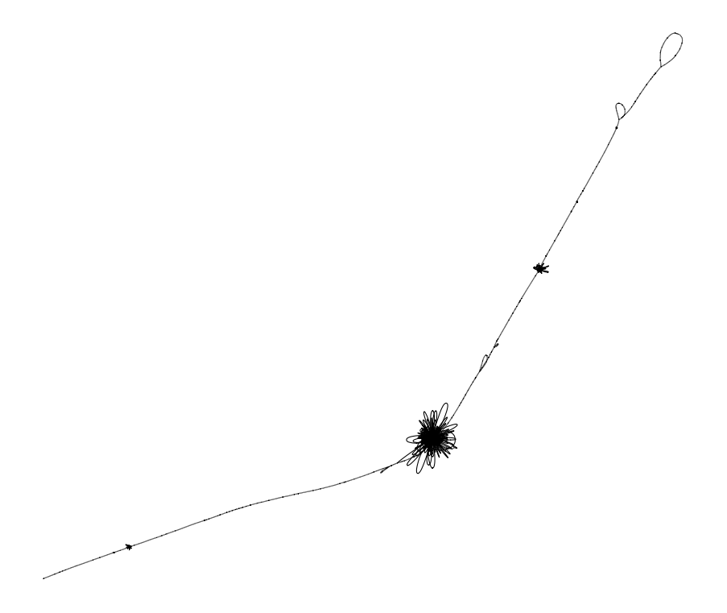

# Walkthrough — the LPA locus, end to end

A single worked run of the whole pipeline on one real locus: LPA (the `LPA` gene's KIV-2 VNTR — a variable-number tandem repeat whose copy number is a known cardiovascular risk factor). It shows the usage of all the modules in `panvar` with the exception of `associate`, which is covered by the dedicated [GWAS example](gwas.md); here it is only pointed at.

Every command runs against the committed test graph `tests/real_data/lpa.gfa.gz` and writes under `results/real_data/lpa/`. The whole run is reproduced by `scripts/regen_results.sh lpa`. The reference path is `GRCh38#0#chr6:160509252-160734894`.

```bash
GFA=tests/real_data/lpa.gfa.gz
REF="GRCh38#0#chr6:160509252-160734894"
OUT=results/real_data/lpa
```

---

## 1. `bubble` — find the variant sites

Sorts/flips the graph along the reference and decomposes it into bubbles (snarl sites where haplotypes diverge). On LPA this yields 12 bubbles; the KIV-2 tandem is bubble 7, spanning ~12–184 kb across the 466 haplotypes (its size is the copy-number variation).

```bash
./build/panvar bubble \
-i "$GFA" \
-o "$OUT/bubble/bubble" \
-r "$REF" \
--gtf tests/real_data/Homo_sapiens.GRCh38.116.gtf.gz
```

Bandage plot, from `$OUT/bubble/bubble.sorted.gfa` + `bubble.bandage_nodes.csv`):



The linear reference backbone with the KIV-2 site ballooning into a dense tangle of parallel node paths — one strand per copy-number allele. That tangle is bubble 7.

---

## 2. `inspect` — cluster the haplotypes at the site

A sanity check on one bubble: it pulls every haplotype's `source → sink` walk through bubble 7 and clusters them by walk similarity.

```bash
./build/panvar inspect \
  -i "$OUT/bubble/bubble.sorted.gfa" \
  --bubble-prefix-in "$OUT/bubble/bubble" --bubble-id 7 \
  --cluster \
  --cluster-similarity 0.95 \
  -o "$OUT/inspect/inspect"
```

Then, run `scripts/plot_node_coverage_heatmap.R`:

```bash
Rscript scripts/plot_node_coverage_heatmap.R \
  --table "$OUT/inspect/inspect.bubble_7.node_counts.tsv" \
  --node-lengths "$OUT/inspect/inspect.bubble_7.node_lengths.tsv" \
  --cluster-by "$OUT/inspect/inspect.bubble_7.clusters.tsv" \
  --clusters "$OUT/inspect/inspect.bubble_7.clusters.tsv" \
  --out "$OUT/plots/lpa_node_heatmap"
```



Rows are (representative) haplotypes, columns are the repeat-unit nodes. A haplotype with more KIV-2 copies traverses the unit nodes more times, so its row is warmer across the repeat block — the heatmap is a direct picture of the copy-number ladder. Drop `--clusters` to show all the haplotypes.

---

## 3. `panphorte` — fold the tandem into a countable unit

The KIV-2 array is spelled out copy-by-copy in the graph, which would mis-type as a pile of insertions. `panphorte` collapses each detected tandem array onto one repeat-unit (`REP`) node with a self-loop, so copy number becomes the loop-traversal count. On LPA bubble 7 it folds a 5,547 bp unit carried by all 466 haplotypes, collapsing 3,484 nodes, with copies ranging 1–32.

```bash
./build/panvar panphorte \
  -i "$OUT/bubble/bubble.sorted.gfa" \
  --bubble-prefix-in "$OUT/bubble/bubble" \
  -o "$OUT/panphorte/panphorte" \
  --reference-path "$REF" \
  --min-similarity 0.90 \
  --gtf tests/real_data/Homo_sapiens.GRCh38.116.gtf.gz
```



The KIV-2 tangle has collapsed to a single node with a self-loop back onto itself — the whole array is now one countable unit. Contrast with the step-1 Bandage view of the same site.

---

## 4. `inspect` again — on the folded graph

The same cluster view, now on the `panphorte` output, confirms the fold preserved the per-haplotype signal: the copy-number ladder is still there, just read off self-loop traversals instead of a long node run.

```bash
./build/panvar inspect \
  -i "$OUT/panphorte/panphorte.normalized.sorted.gfa" \
  --bubble-prefix-in "$OUT/panphorte/panphorte" --bubble-id 7 \
  -o "$OUT/inspect/inspect_panphorte"
```

Then, run `scripts/plot_node_coverage_heatmap.R`. Let's use the clusters coming from the previous `inspect` run to have a clear visual comparison with the previous heatmap:

```bash
Rscript scripts/plot_node_coverage_heatmap.R \
  --table "$OUT/inspect/inspect_panphorte.bubble_7.node_counts.tsv" \
  --node-lengths "$OUT/inspect/inspect_panphorte.bubble_7.node_lengths.tsv" \
  --cluster-by "$OUT/inspect/inspect.bubble_7.clusters.tsv" \
  --clusters "$OUT/inspect/inspect.bubble_7.clusters.tsv" \
  --out "$OUT/plots/lpa_node_heatmap_panphorte"
```




---

## 5. `refine` — remove graph-builder artifacts (optional)

`call` diffs node-walks, so when the graph builder splits one true event across adjacent snarls it reports the split as separate records. `refine` re-aligns the actual per-haplotype interior sequences with POA (abPOA), collapsing such artifacts, and emits panphorte's output family so its graph is a drop-in for `call`. It is opt-in, sequence-lossless, and `DUP`-safe: folded self-loop REP nodes (like LPA's KIV-2 unit) are held fixed and only the residual flanks around them are re-aligned; a bubble carrying an unfolded copy-number revisit is skipped.

```bash
./build/panvar refine \
  -i "$OUT/panphorte/panphorte.normalized.sorted.gfa" \
  --bubble-prefix-in "$OUT/panphorte/panphorte" \
  --reference-path "$REF" \
  -o "$OUT/refine/refine" \
  --gtf tests/real_data/Homo_sapiens.GRCh38.116.gtf.gz
```

On LPA the KIV-2 tangle (bubble 7) is left untouched — it carries an unfolded revisit, so the DUP copy-number signal is preserved intact — while smaller bubbles are cleaned (e.g. a balanced +439/−439 bp INS+DEL pair, the same displaced sequence the builder split in two, collapses to nothing). To type the refined graph, point `call`/`describe`/`inspect` at the refine prefix instead of the panphorte one (`-i "$OUT/refine/refine.normalized.sorted.gfa" --bubble-prefix-in "$OUT/refine/refine"`). The rest of this walkthrough stays on the panphorte output, since the LPA copy-number story is unaffected.

---

## 6. `call` — type the variants and read copy number

Diffs every haplotype against the reference and emits a VCF. On LPA: 7 DEL, 13 INS, 3 DUP. The headline record is the KIV-2 DUP on bubble 7: `REF_CN=6`, `RU_LEN=5547`, with a per-sample `CN` spanning 1–32 copies (and `CNBP` giving the actual bp each haplotype gains/loses).

```bash
./build/panvar call \
  -i "$OUT/panphorte/panphorte.normalized.sorted.gfa" \
  --bubble-prefix-in "$OUT/panphorte/panphorte" --reference-path "$REF" \
  -o "$OUT/call/call" \
  --cn \
  --gtf tests/real_data/Homo_sapiens.GRCh38.116.gtf.gz
```

`scripts/plot_vcf_map.R` plot the oncoprint-style variant map), subsetting to 50 haplotypes:

```bash
Rscript scripts/plot_vcf_map.R \
  --vcf "$OUT/call/call.region.vcf" \
  --reference-path "$REF" \
  --out "$OUT/plots/lpa_vcf_map" \
  --max-paths 50
```




Rows are haplotypes, columns are called variants grouped by bubble. The KIV-2 column is the wide blue band shaded by `FORMAT:CN` — dark = high copy number. DEL are red, INS green/purple, INV orange. The KIV-2 blue gradient is the copy-number spectrum the whole pipeline was after.

For a per-node, interactive view of the same calls, build the viewer bundle and launch the Shiny + plotly app (`scripts/build_variant_node_data.R` + `scripts/variant_node_heatmap_app.R`; needs `shiny`, `plotly`, `data.table`, `DT`):

```bash
Rscript scripts/build_variant_node_data.R \
  --gfa "$OUT/panphorte/panphorte.normalized.sorted.gfa" \
  --variant-nodes "$OUT/call/call.variant_nodes.tsv" \
  --vcf "$OUT/call/call.region.vcf" \
  --bubbles "$OUT/panphorte/panphorte.bubbles.csv" \
  --node-genes "$OUT/call/call.node_genes.tsv" \
  --out "$OUT/plots/lpa_variant_nodes.rds"

VN_RDS="$OUT/plots/lpa_variant_nodes.rds" Rscript scripts/variant_node_heatmap_app.R
```

The app serves at `http://127.0.0.1:<port>` (printed on launch). It opens on the representative haplotypes across the whole locus: each row is a haplotype, each column a variant node (width ∝ node length) coloured by traversal count — white = untraversed, grey = ×1, red-gradient = ×2+ — so the KIV-2 `DUP` shows as the deep-red copy-number band. Hover a node for its gene/coverage/genotype; pick a bubble to zoom, or click a `variant_id` to pull up its carriers.



---

## 7. `describe` — genotype features for association

Turns the called bubbles into per-haplotype dosage features (k-mer, node/edge graph, and per-variant), exported as BIMBAM matrices — the input to `associate`. Restricting to the called variant nodes keeps only features that carry signal.

```bash
./build/panvar describe \
  -i "$OUT/panphorte/panphorte.normalized.sorted.gfa" \
  --bubble-prefix-in "$OUT/panphorte/panphorte" \
  --out-dir "$OUT/describe" \
  --variant-nodes "$OUT/call/call.variant_nodes.tsv"
```
---

## 8. `associate` — the GWAS

Association (`phenotype ~ genotype`, multiple-testing correction, conditional independence) is its own worked example on this exact LPA output: see [GWAS example](gwas.md). In short, testing the KIV-2 features against a Lp(a) phenotype recovers the KIV-2 copy-number signal as the region's top hit, and structure correction keeps the genomic-inflation λ ≈ 1.


---

## 9. `benchmark` — round-trip reconstruction of the calls

How faithfully do the calls reconstruct the haplotypes? For each called bubble and each haplotype, `benchmark` rebuilds the haplotype from the reference walk with only the called events applied (which nodes each call explains comes from `variant_nodes.tsv`), aligns that to the haplotype's true graph walk, and reports the reconstruction identity `= 1 − Σδ/ΣS`. Uncalled variation (SNPs, sub-50 bp indels) is exactly what keeps it short of perfect. (A comparability `QV = -10·log10(max(0.5, δ)/S)` is emitted alongside but is no longer the headline.)

```bash
./build/panvar benchmark \
  -i "$OUT/panphorte/panphorte.normalized.sorted.gfa" \
  --bubble-prefix-in "$OUT/panphorte/panphorte" \
  --reference-path "$REF" \
  --variant-nodes "$OUT/call/call.variant_nodes.tsv" \
  -o "$OUT/call/benchmark"
```

The per-gene headline is per-haplotype reconstruction identity (`1 − Σδ/ΣS`) — length-fair, unlike an absolute QV that a short region can never push high. `scripts/plot_benchmark.R` draws the per-gene anatomy: the left panel stacks Reconstructed (identity) + Residual to 100% of the aligned sequence, and the right panel splits that residual only into Not-callable (sub-threshold) vs Mis-called (≥ threshold) — so a tiny residual stays legible:



Every haplotype across every locus reconstructs at >99.9% identity (left panel ~all green), and the residual is essentially all Not-callable (right panel blue) — no callable-size misses. On LPA, the copy number lands exactly (the DUP module scores δ=0); its residual is small sub-threshold variation, e.g. a ~32 bp insertion at one bubble that sits just under `--min-sv-bp=50`. GSTM1 sits lowest (its paralog stack is dense with small paralogous sequence variants) but is still >99.9%. This confirms the calls round-trip the haplotypes. (Match `benchmark --min-sv-bp` to the `call` run, or 20–50 bp variation that was correctly not called would show up as Mis-called.)

---

## Not just LPA — the other duplicated loci

The same pipeline is validated on C4 (C4A/C4B), GSTM1 (GSTM1/2/5), CYP2D6 (CYP2D6/2D7/2D8P), and ACOT (ACOT1/ACOT2 on chr14). `scripts/regen_results.sh` runs all of them and checks copy number against the pangene ground truth:

```bash
scripts/regen_results.sh              # all loci + validation + plots
Rscript scripts/plot_cn_correlation.R \
  --table results/cn_table.tsv \
  --out results/cn_correlation        # the two panels below
```

Total copy number per locus (called vs ground truth):



Per-gene split for the paralog clusters:



Every point on the diagonal is an exactly-correct call. Locus totals are exact (LPA 465/465, C4 131/131, GSTM1 159/159, ACOT 467/467); the per-gene splits land C4A/C4B at 96.2%, CYP2D6 99.2%, CYP2D7 100%, the whole GSTM cluster (GSTM1, GSTM2, GSTM4, GSTM5) at 466/466 each, and ACOT1/ACOT2 at 99.6% (100% within ±1) — the off-diagonal C4/CYP/ACOT handful are gene-conversion mosaics and unannotated pseudogene/hybrid modules. Stable single-copy genes outside the folded module (GSTM3, ACOT4, ACOT6) have nothing to resolve, so they are not split out.

---

## `rebuild` — re-inducing a tangled locus

The loci above all decompose cleanly, but a minority of graphs come out of construction too tangled to work with. Where the graph inducer closes over all-pairs alignments, sequence that recurs across a low-complexity locus collapses onto a few very high-degree hub nodes, and snarl finding then returns one large undecomposable site instead of a set of variant sites. The opt-in, gated `rebuild` step re-induces such a locus from its haplotype sequences before `bubble`, and leaves healthy graphs untouched, so it is not part of the LPA run above.

MYOM2 (chr8) is one such locus. As originally built, its interior is a dense hub — hundreds of near-identical paths knotted onto shared nodes — with the rest of the graph strung off it:


After `rebuild`, the same haplotypes re-induce into a graph that reads as a backbone with discrete bubbles at the variant sites, no hub, and the copy-number arrays showing as small loops along the path:



On this locus `rebuild` takes ~80,000 nodes with a 1,035-degree hub down to ~490 nodes with no hub, so `bubble` finds a few dozen clean variant sites instead of one giant snarl and `call` stops mis-firing hundreds of spurious duplications. See [modules/rebuild.md](modules/rebuild.md) and [algorithms/rebuild.md](algorithms/rebuild.md) for the gate, the haplotype ordering, and how minigraph drives the re-induction.
